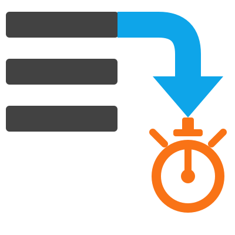
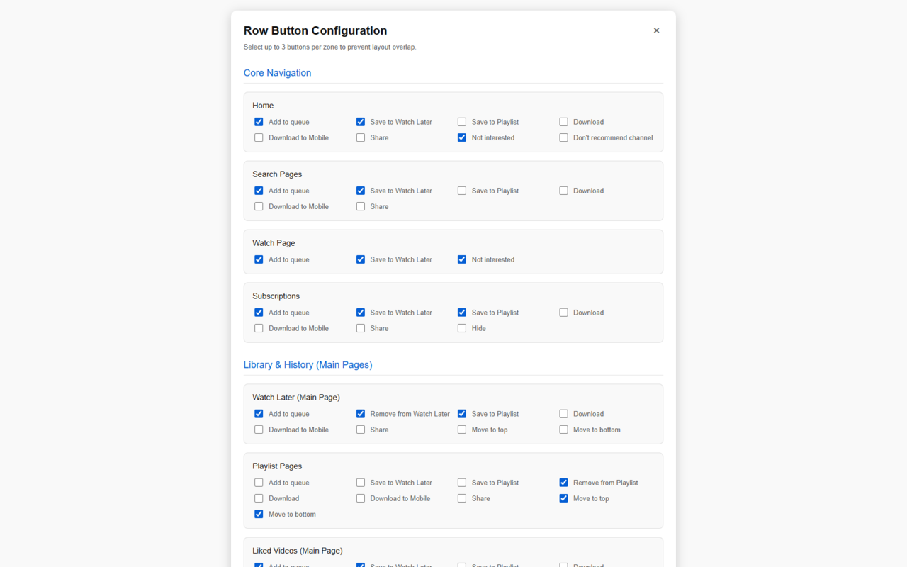
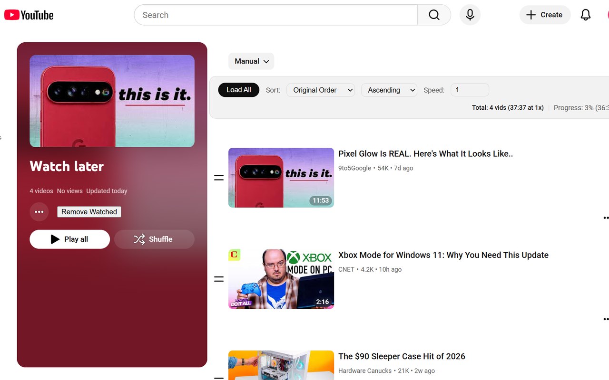
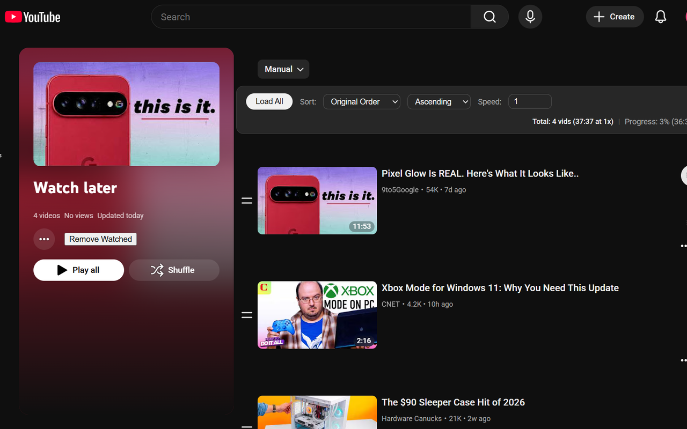
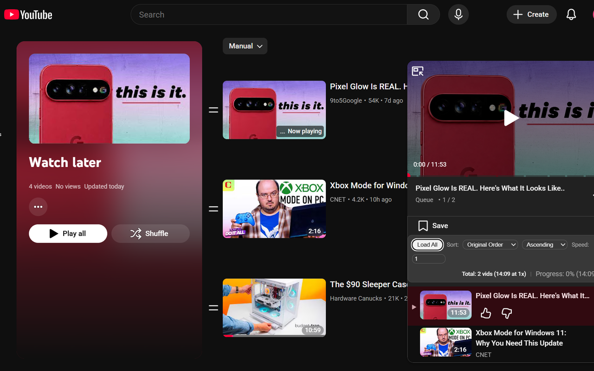
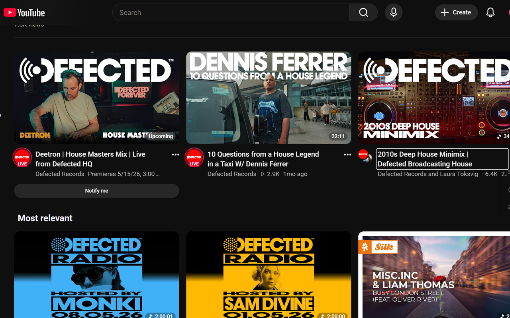
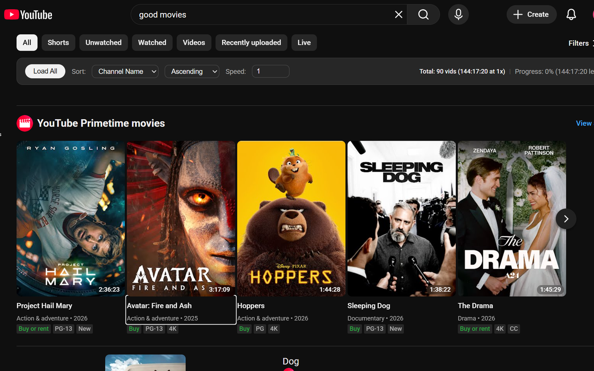
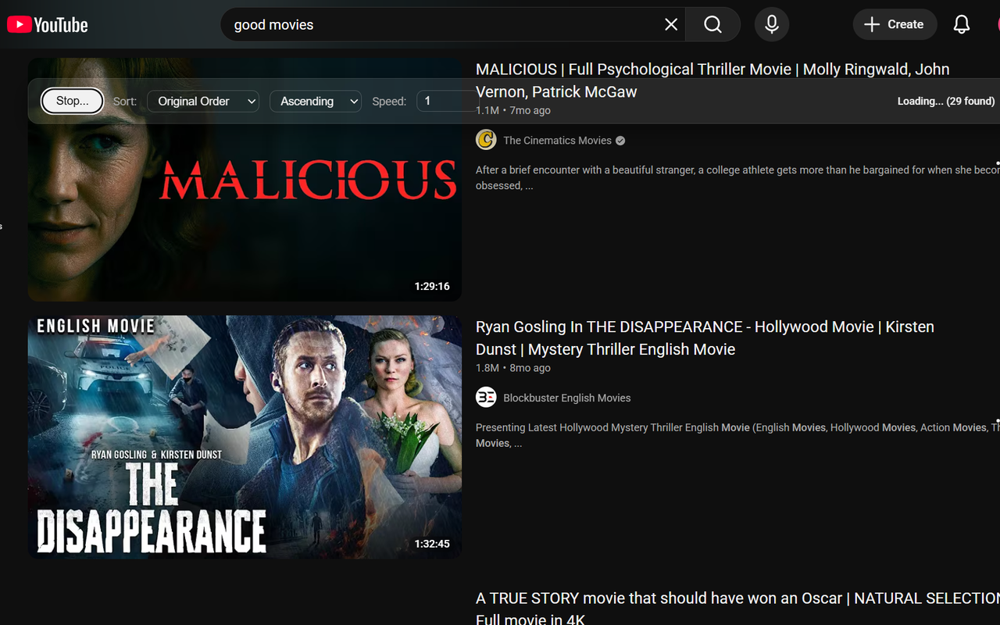

# YouTube Playlist Tools

  

A powerful, fully accessible browser extension that adds advanced sorting, real-time statistics, and one-click buttons to YouTube playlists.

## Key Features

* **Instant "Load All":** Solves the "infinite scroll" problem by loading videos in a playlist into the DOM. This ensures screen readers can navigate the entire list and sorting is 100% accurate. Loading stops at 3000 videos or at the end of the playlist. You can also stop it beforehand.
* **Smart Time Math:** Automatically calculates the total playlist duration and remaining watch time. 
* **Dynamic Speed Scaling:** Adjust the "Speed" input (e.g., 1.5x, 2.0x) to see your "Time Remaining" update instantly based on your playback pace.
* **Speed Sync:** Now speed will adjust based on the speed control in the toolbar. The speed control also stays in sync with video speed if set via another method.
* **Quick Actions:** Set up one-click buttons to take your most common actions on videos:
    * **Add to queue:** Queue up a bunch of videos fast!
    * **Save to Watch Later:** Add videos to your Watch Later without realizing how easy it is, then get frustrated that you now have over 80 hours of videos you won't be able to get through for a long time. Yes, I have a problem.
    * **Remove from queue/playlist (hide on subscriptions page):** Instantly nuke that video you watched or found boring and uninteresting.
* **NEW!** Fully customize the quick action buttons in the options page:
    * Select up to three buttons with the checkboxes for each section.
    * Rearrange the layout by dragging the checkboxes to the order you prefer. Want to select the Download button and make it the first option? It can happen!
* **Built for Accessibility:**
    * **Visual Info Accessibility:** For screen reader users, puts watched percentages directly in the heading for videos. Now you'll see exactly how much of that long documentary you've watched. We've never had access to this information before! News, live and upcoming videos are also indicated, making it even faster to skim through videos.
    * **Get the Most Information:** For screen reader users, you'll always see the best version of the ARIA label on videos that includes the time. This wasn't being shown in the miniplayer queue.
    * **Proper Button Labels:** For screen reader users, the miniplayer queue button is labeled. No guessing what that button is.
    * **Keyboard Support for Reordering:** Checkboxes in the options page can be reordered in each of the various sections with Alt/Option plus the up or down arrows.
* **Advanced Sorting:** Organize your videos by:
    * Original Order (Default)
    * Alphabetical (A-Z)
    * Channel Name (Group by creator)
    * Date Published (Get to your newest videos first)
    * Length (Shortest to longest)
    * Most Popular (Watch what everyone else watched first)
    * Watch Progress (Watched vs. Unwatched)

## Screenshots

## Pro Tip: Chained Sorts

Since this extension uses stable sorting algorithms, you can chain sorts together to make secondary and even tertiary orderings! The trick is to apply your sorts in reverse order of importance.
For example: if you want to group videos by Channel and have each channel's videos ordered by Views, Sort by Most Popular first, then sort by Channel Name. To reset everything, just sort by Original Order again.

## Accessibility First

This project was built specifically with  screen reader users (NVDA, JAWS, VoiceOver) in mind.

* **Stable UI:** Injects a consistent toolbar that stays where you're focused, whether it be in a full playlist or the miniplayer queue.
* **ARIA Live Regions:** Status updates and error messages are announced immediately to assistive technology.
* **Theme-Matching:** Seamlessly matches the page's color in light or dark mode.

## What's New

### 3.19: What was supposed to be a small update
* Updated the toolbar to appear almost everywhere. Sort on the subscriptions page, watch later, even a channel's streams and videos.
* Added one-click buttons in more places. They're also contextually aware depending on the page and type of content. Only the buttons that are in the action menu are available.
* Renamed sorting methods to be a little more explanatory. For example, Index is now Original Order, Duration is now Length, Views is now Most Popular, etc.
* Sorting by channel name also groups movies by genre!
* Updated sorting function to keep items grouped in the shelf they're originally in. Sorting also brings live content to the top and sorts them together.
* Fixed minimum and maximum speed to not go outside actual limits.
* Set speed should stick between videos.
* **Massive Architectural Overhaul:** Replaced hardcoded buttons with a dynamic Button Factory powered by Chrome Storage Sync.
* Added a brand-new Options Page! You can now customize exactly which buttons (up to 3) appear in 16+ different YouTube zones.
* Added drag-and-drop button reordering to the Options page (fully screen-reader accessible via Alt/Option + Arrow keys).
* **Live Updates:** Changing button layouts in the Options page instantly redraws buttons across all open YouTube tabs—no refresh required!
* Added Import/Export functionality: Back up, restore, and share your exact layout preferences via JSON files.
* Added native Light/Dark mode support for the Options page to match system settings seamlessly.
* Added specialized layout handling for the Premium Benefits page (safely suppresses the toolbar and enforces the "Not interested" button).
* Opens in a new tab on update/new install to show this page.

### 2.51 (Yes, there are that many new features and updates in here!)
* **THEME INTEGRATION:** The toolbar now seamlessly matches YouTube's Light and Dark modes!
* Added date and view count sorting. I know you can sort by date with YouTube sorting, but why not have it all? Hopefully it prevents at least one bad rating.
* **MINIPLAYER QUEUE SUPPORT:** Expanding the miniplayer queue now docks the toolbar above the queued videos, allowing you to see the total duration of your queue and apply temporary sorts. Very handy to leave open and watch the updating progress as you add videos to the queue!
* **ONE-CLICK BUTTONS:** You can now add to queue/watched later, remove watched videos from watch later, remove video from current playlist/queue, and hide video on the subscriptions page with one click. No more extra clicks for essential actions.
* **UPDATED SPEED CONTROL:** Now setting the speed in the toolbar will update the video speed! It also follows the speed of the video if it gets set by another method.
* **WATCHED ACCESSIBILITY:** Added watched percentages to the beginning of ARIA labels on videos. This information hasn't ever been shown to screen reader users! Now you'll always know if you watched a video, and how much of it you've watched.
* **OTHER ACCESSIBILITY IMPROVEMENTS:** Updated the video's ARIA label to use the best version with the most information and labeled the miniplayer queue button.

### 1.71
* Updated the sorting function so that if the whole playlist isn't loaded, it won't load additional videos or cause some to disappear.

## Installation (Developer Mode)

1. Download or clone this repository.
2. Open Chrome and navigate to `chrome://extensions`.
3. Enable **Developer Mode** (toggle in the top right).
4. Click **Load Unpacked** and select the project folder.

## License

This project is licensed under the **GNU GPLv3**. 

You are free to use, modify, and distribute this software, provided that any derivative works are also licensed under the GPLv3 and remain open-source. See the `LICENSE` file for the full legal text.